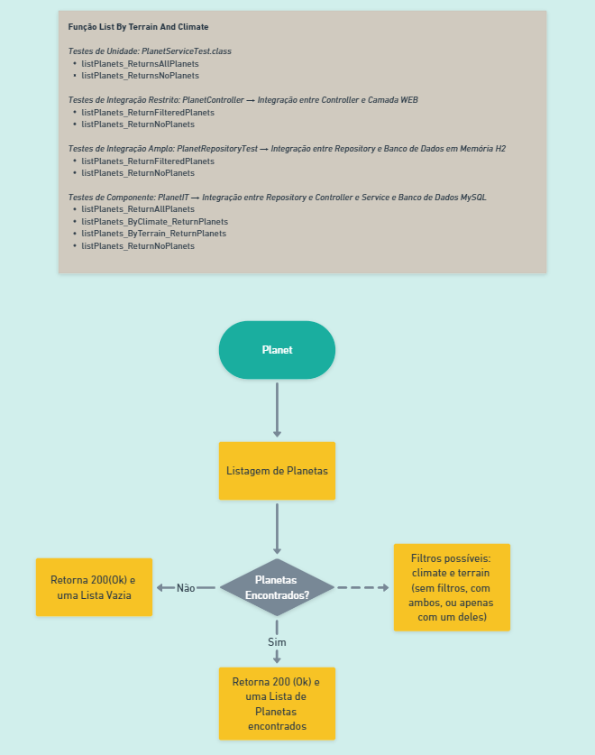
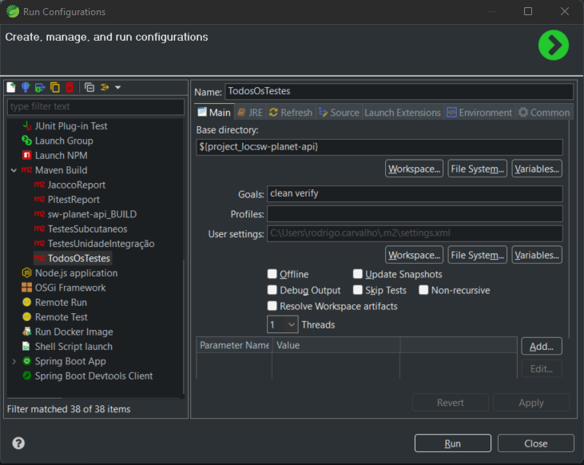
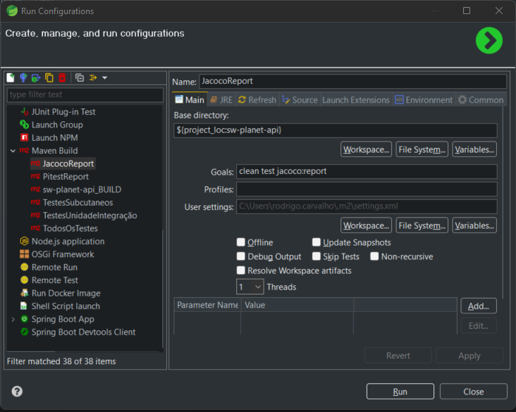

# API Star Wars Planets

Aplicação desenvolvida para realizar os testes desta prospecção simula um sistema de informações planetárias da franquia Star Wars.


Esta aplicação possui o MongoDB como seu Banco de Dados e conta com a implementação de TDD.


### Tecnologias Empregadas
- [Mysql](https://dev.mysql.com/downloads/mysql/)
- [H2](https://www.h2database.com/html/main.html)
- [Java](https://www.oracle.com/java/technologies/downloads/)
- [Maven](https://maven.apache.org/download.cgi)
- [Spring Boot](https://spring.io/projects/spring-boot)
- [Spring Testing](https://docs.spring.io/spring-framework/docs/current/reference/html/testing.html#testing-introduction)
- [JUnit 5](https://junit.org/junit5/docs/current/user-guide/)
- [Mockito](https://site.mockito.org)
- [AssertJ](https://github.com/assertj/assertj)
- [Hamcrest](http://hamcrest.org/JavaHamcrest/)
- [Lombok](https://projectlombok.org/)
- [Jacoco](https://github.com/jacoco/jacoco)
- [Pitest](https://pitest.org)

Vale ressaltar que:
* JUnit - Responsável por registrar o Teste Automatizado (@Test) no framework do SpringBoot.
* AssertJ - Responsável por aferir os resultados dos Testes Automatizados.
* Mockito - Framework utilizado para automatizar a criação de Dublês de Teste. Dublês de Teste são utilizados pelos testes solitários para simular o comportamento das suas dependencias, aumentando a performace da execução dos testes.

## Testes de Função Create


## Testes de Função Get By Id


## Testes de Função Get By Name


## Testes de Função List By Terrain And Climate


## Testes de Função Delete


## Resultado dos Testes

### Teste Unidade


### Testes Integração


### Testes Componente


## Divisão de Execução dos Testes
A divisão da execução dos testes foi feita por meio do Plugin Surefire.


### Execução Testes Leves (Unidade e Integração)


### Execução Testes Pesados (Componente)


### Execução Todos Testes


### Jacoco: Análise de Cobertura de Testes
A cobertura de teste baseada em código mede a quantidade de códigos executada durante o teste, em comparação à quantidade de códigos com execução pendente. A cobertura de código pode se basear em fluxos de controle (instrução, ramificação ou caminhos) ou fluxos de dados.

#### Relatório de Cobertura


#### Run Configuration


### Pintest: Análise de Testes Mutantes
Os testes de mutante são feitos para avaliarem a qualidade da bateria de casos de testes automatizados. A ideia principal é modificar, ou melhor, mutar uma pequena parte de código a ser testado e verificar se o teste automatizado irá detectar esta mutação. Se não detectar a mutação se torna um teste em vão.

#### Relatório de Testes Mutantes


#### Runtime Statistics


#### Run Configuration


## Configuração
O projeto requer um banco de dados Mysql, então é necessário criar uma base de dados com os seguintes comandos:

```
$ sudo mysql

CREATE USER 'user'@'%' IDENTIFIED BY '123456';
GRANT ALL PRIVILEGES ON *.* TO 'user'@'%' WITH GRANT OPTION;

exit

$ mysql -u user -p

CREATE DATABASE starwars;

exit
```
Durante os testes, as tabelas de banco já serão criadas automaticamente no banco de dados.


